# AI Companion Subscription

Subscription service for the Eva AI Companion app. It manages Razorpay subscription checkout, stores user subscription state in MongoDB, and syncs the latest status from Razorpay.

## Current Plan

```text
Plan ID: plan_TRv3HKpujDyFoS
Plan Name: Eva Premium Monthly
Billing Amount: INR 299.00
Billing Frequency: Every Month
```

## Flow

```mermaid
flowchart TD
    A[Android App Premium Screen] --> B[Main AI Companion Backend]
    B --> C[Subscription Service]
    C --> D[Razorpay Create Subscription]
    D --> E[Hosted short_url Checkout]
    E --> F[User Authorises Monthly Payment]
    F --> G[App Resumes]
    G --> B
    B --> H[Sync Subscription Status]
    H --> C
    C --> I[Razorpay Fetch Subscription]
    I --> J[MongoDB Subscription Record]
    J --> K[Premium Active / Not Active]
```



## API

All user-specific routes require these headers from the trusted main backend:

```text
x-service-api-key: <SERVICE_API_KEY>
x-user-id: <authenticated user id>
x-user-email: <authenticated user email>
```

Endpoints:

```text
GET  /api/v1/health
GET  /api/v1/plans/premium
GET  /api/v1/subscriptions/me
POST /api/v1/subscriptions/checkout
POST /api/v1/subscriptions/sync
```

## Environment

```env
NODE_ENV=production
PORT=4010
HOST=0.0.0.0
MONGODB_URI=your-mongodb-uri
MONGODB_DATABASE=ai_companion_subscriptions
SERVICE_API_KEY=replace-with-a-long-random-internal-service-key
RAZORPAY_KEY_ID=your-razorpay-key-id
RAZORPAY_KEY_SECRET=your-razorpay-key-secret
RAZORPAY_SUBSCRIPTION_PLAN_ID=plan_TRv3HKpujDyFoS
RAZORPAY_SUBSCRIPTION_PLAN_NAME=Eva Premium Monthly
RAZORPAY_SUBSCRIPTION_AMOUNT=29900
RAZORPAY_SUBSCRIPTION_CURRENCY=INR
RAZORPAY_SUBSCRIPTION_TOTAL_COUNT=120
```

## Local Development

```bash
npm install
cp .env.example .env
npm run dev
```

